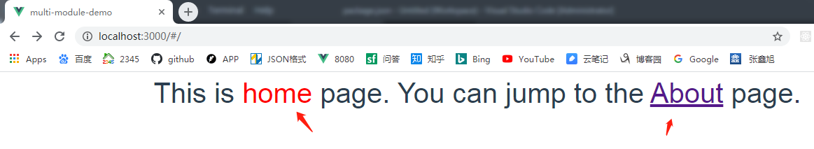

## multi-module-demo，根据不同build命令，使用不同的路由文件，从而实现分模块打包

## Project setup
```
npm install
```

### 使用 src/router/index.js 这个路由配置打包
```
npm run build
```


### 使用 src/router/indexA.js 这个路由配置打包 
```
npm run build:mis
```

### 打包成功后，使用express启动一个server，把静态文件拷贝进去查看效果

### Customize configuration
See [Configuration Reference](https://cli.vuejs.org/config/).
